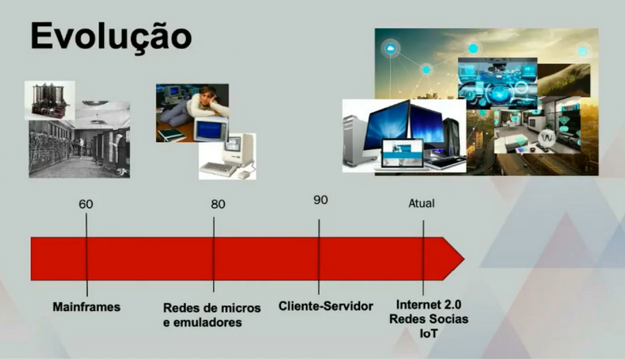
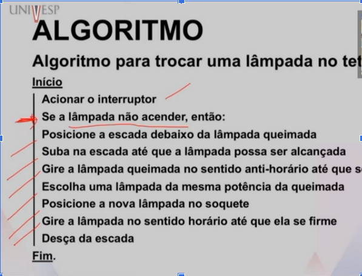
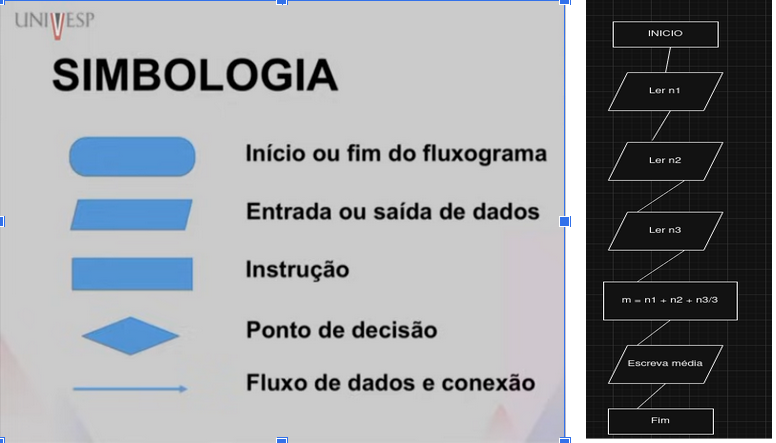
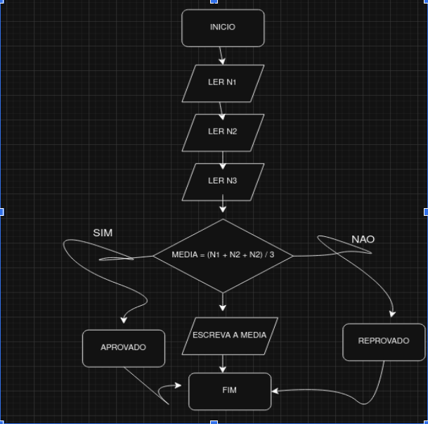

# Algoritmos e Programação de Computadores I 
Professor Marcelo G. Manzato

## Semana 1

**Noção de Algoritmos**



**Ciclo**
* **Projetar a solução:** Planejar a lógica e o fluxo antes de escrever o código.
* **Codificar a solução:** Traduzir o projeto para uma linguagem de programação (ex: Python).
* **Testar o programa:** Executar o código e verificar se os resultados estão corretos.

**ALGORITMO**

Sequência de passos que visa atingir um objetivo bem definido. O computador não tem senso próprio e deve receber instruções explícitas e precisas (algoritmos).

Um algoritmo correto deve possuir 3 qualidades:

1. Uma instrução que possa ser realizada.
2. A ordem dos passos deve ser precisamente determinada.
3. Deve ter fim.

---

Exemplo: Trocar uma lâmpada no teto.

**início**
  Remova a lâmpada queimada.
  Coloque a nova lâmpada.
**fim**
O que é necessário para remover a lâmpada queimada? (Pode ser meio raso isso, então o ideal é detalhar).



**Teste seletivo:** Determinar qual conjunto deve ser seguido, dependendo do resultado pode ser verdadeiro ou falso.

---

**Exercício:** Assistir ao filme Coringa no cinema

Pensar e adicionar: E se não estiver passando? E se houver fila? E se não houver lugar?

**INÍCIO**
    Ir ao cinema
    Se o filme do Coringa não estiver passando:
        Voltar para casa
    Senão:
        Se houver fila:
            Esperar na fila
        Comprar uma entrada
        Escolher um assento
        Se não houver lugar:
            Voltar para casa
        Senão:
            Verificar o assento
            Assistir ao filme
            Voltar para casa
**FIM**

---

**Fluxogramas**

Representação esquemática de um algoritmo, feita através de gŕaficos que ilustram a transcrição de informações entre os elementos que o compõem.




**Exercício:** modifique o exemplo anterior para calcular a média de notas para 100 alunos.



**OBS:** (N1 + N2 + N3) / 3

--- 

**Python**

- Desenvolvida no final da década de 80 por Guido Van Rossum.
- Projetada para desenvolver programas de alta legibilidade.
- Possui uma vasta biblioteca para diferentes aplicações.
- Grande popularidade nos últimos anos.

```python
print('Hello, world')
print('Programmed to work and not to feel')
```