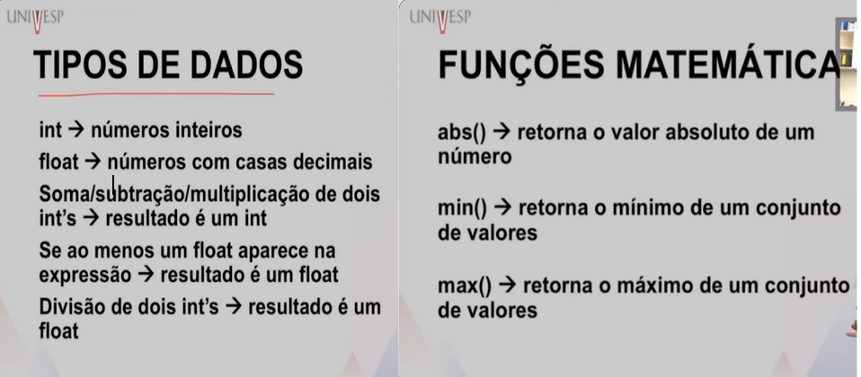
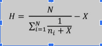
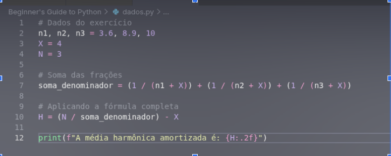
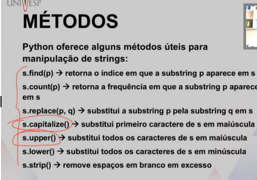

# Tipos de dados (parte 1)
Professor Marcelo G. Manzato

## Semana 2

**Expressões Aritméticas e Operadores**

Operadores cujo operandos são números, constantes ou variáveis do tipo numérico.
( + - * / // % **)  

// = divisão inteira. 
% = retorna o resto de uma divisão.
** = potência.

**Tipos de dados e funções matemáticas:**

**Exercício:** Modifique o exemplo anterior para calcular a média harmônica amortizada dos mesmos números: 3.6, 8.9 e 10. Utilize X = 4 como fator de amortização.

---

**Operadores relacionais** (operadores que relacionam a números, expressões, constantes, comparações) 

== – igual a 
!= –  diferente de 
< –  menor que
> –  maior que
<= – menor ou igual a
>= –  maior ou igual a

--- 

**Variáveis**

**Strings:** As Strings (str) no Python são sequências de caracteres delimitadas por aspas simples ('...') ou aspas duplas ("..."). Elas aceitam letras, números, espaços e símbolos.

---

Codigos de Exercício:

* [Cálculo de Média Harmônica e Amortização](./codes/dados.py)
* [Manipulação de Strings e Variáveis](./codes/variaveis.py)