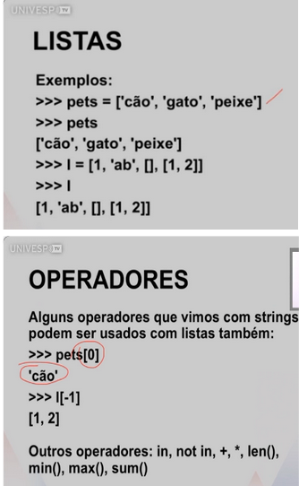

# Tipos de dados (parte 2)
Professor Marcelo G. Manzato

**Aprendizado de listas, tuplas e operadores**

**Listas:** Uma lista é uma sequência de objetos. Pode ser de qualquer tipo: int, float (pode misturar). Uma lista é representada por objetos separados por vírgula, envoltos por colchetes.

**Tuplas:** Tuplas são iguais, mas imutáveis. E utilizamos parênteses (()) ao invés de colchetes para criá-las. 

**Métodos:**

- count → conta quantas vezes um elemento aparece na lista
- index → retorna a posição da primeira ocorrência do elemento
- insert → insere um elemento em uma posição específica
- pop → remove e retorna um elemento (por padrão o último)
- remove → remove a primeira ocorrência de um elemento
- reverse → inverte a ordem da lista
- sort → ordena os elementos da lista

---

Tarefas realizadas:

- [Listas Mutáveis](lista-mutavel.py)
- [Tupla](tupla.py)
- [Atividade Avaliativa](atividade-avaliativa.md)

