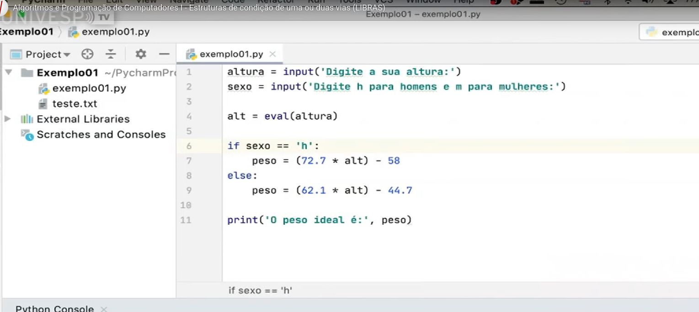

# Estruturas de condição de uma ou duas vias
Professor Marcelo G. Manzato

## Semana 5

As estruturas de solução permitem escolher um conjunto de ações — chamadas de bloco.

- Um bloco de instruções é delimitado por indentação (quando você desloca o texto para a direita).

- A escolha de qual bloco executar depende de uma condição ser ou não satisfeita.

A condição é representada por expressões lógicas ou relacionais.

**Estruturas de seleção**

As estruturas de seleção podem ser:

- seleção de uma via.
- seleção de duas vias.
- seleção de três ou mais vias.

---

**Seleção de uma via**

Testa uma condição antes de executar uma instrução

 ```python
    if<condição>:
        <bloco de intruções indentado>
    <bloco de intruuções não identado>
```

**Seleção de duas vias**

Dois blocos alternativos dependendo da condição. `if` for verdadeira é executada. `Else` senão não executa.

```python
if <condição>:
    <bloco de instruções indentado>
else:
    <bloco alternativo indentado>
<bloco fora da seleção>

```

---

**Exercicio**

[Meu Exercicio](codes/exemplo.py)
Exercício feito antes da explicação do professor.

---

[Exercicio do Professor](codes/exemplo-do-professor.py)


Obs: Diferente de mim ele utiliza o `eval()` em vez do `float()`. 

O professor utilizou `eval()` para converter a entrada do usuário em número.

No entanto, pesquisando, descobri que é importante ter atenção em relação ao `eval()` pois ele executa qualquer código Python digitado pelo usuário, o que pode ser perigoso se alguém inserir comandos maliciosos.

Exemplo:

```python
x = eval("2 + 3")   # resultado: 5
x = eval("__import__('os').system('rm -rf /')")  # comando perigoso!
```
Por isso, quando a intenção é apenas converter valores numéricos, o uso de funções como `float()` ou `int()` é muito mais seguro e recomendado:

```python
x = float("2.5")   # resultado: 2.5
x = int("10")      # resultado: 10
```

---

**Exercício 2**

[Exercício](codes/exercicio2.py)