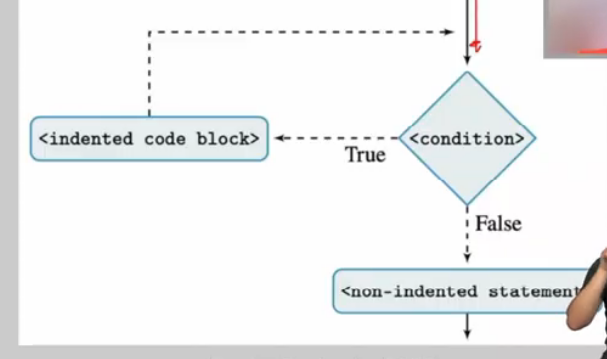

# Estruturas de repetição - while
Professor Marcelo G. Manzato

## Semana 6

O comando while tem uma estrutura parecida com o teste condicional de uma via:

Se a condição for verdadeira continua, se for falsa ela pula pro *bloco não-indentado*

```python
while<condição>
    <bloco de intruções indentado>
<bloco de instruções não-indentado>
```

Fluxograma de Exemplo


---

O comando while é util quando não sabemos quantas vezes um bloco deverá ser repetido.

**Exemplo**
> [Exemplo 1](codes/whileexemplo.py)