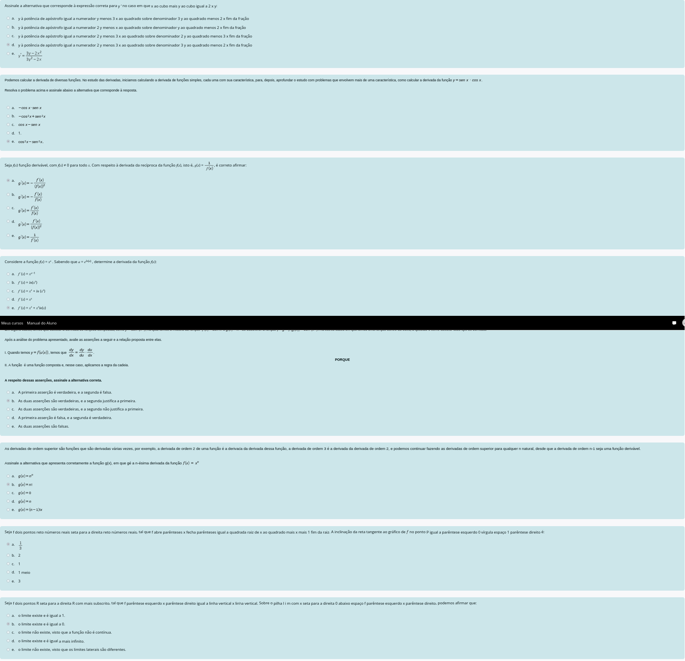

# Semana 3



**Observação:** A questão 7 está inválida. Minha conta:

```
Função: f(x) = √(x² + 1)

f′(x) = (1 / (2√(x² + 1))) · 2x = x / √(x² + 1)

No ponto P = (0,1):
f′(0) = 0 / √(0² + 1) = 0
```

