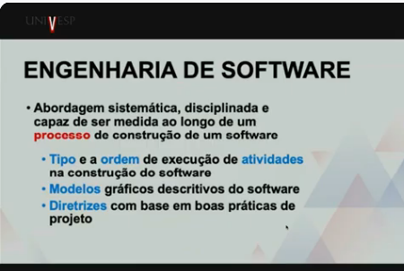

# SEMANA 3
Professora Alessandra Alaniz Macedo

**Projeto de Desenvolvimento de software, algoritmo e implementação (parte1)**

**Projeto:** Esforço temporário, deve ter datas de início e fim definidas. Estipular custos, recursos, força de trabalho, infraestrutura, verbas e prazos.

**Software:** Programas, documentos e estrutura de dados.

**O Software está presente em quase tudo:** IOT, transporte, médico, telecomunicações, militar, industrial, etc…

**Características:** 
- A maioria é feita sob medida/encomenda.
- Desenvolvido ou projetado por engenharia.
- Não se desgasta, mas se deteriora.

**Projeto:** tempo determinado, resultado exclusivo, trabalho inédito.
**Processo:** Tempo indeterminado, resultado padrão, trabalho repetitivo.

**Desenvolvimento de Software, algoritmo e implementação (parte 2)**

- **Fases genéricas:** definição, desenvolvimento e manutenção.
- **Def:** é um conjunto de atividades para especificação, projeto, implementação e teste de software.