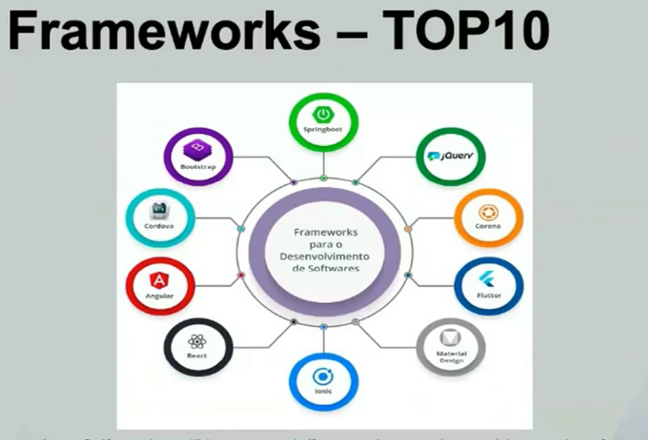
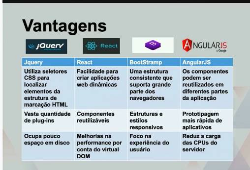
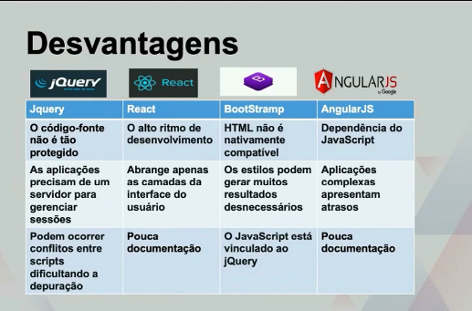

# SEMANA 4
Professora Alessandra Alaniz Macedo

**Bibliotecas e Frameworks**

A ideia central é:  
- **Biblioteca**: conjunto de funções reutilizáveis que você chama quando precisa.  
- **Framework**: define uma estrutura e você encaixa seu código dentro dela.  

---

## Bibliotecas e Frameworks em JavaScript

- **jQuery**: já foi a mais popular, usada em muitos sites pelo mundo. Hoje perdeu espaço para React, Vue e Angular.  
- **React**: biblioteca para criar interfaces eficientes e reativas. Exemplo: Instagram utiliza.  
- **Bootstrap**: fornece suporte para HTML, CSS e JS, facilitando design responsivo. Exemplo: Twitter utiliza.  
- **Angular**: framework escrito em TypeScript. Teve que ser reestruturado devido ao uso desse recurso.  
- **NodeJS**: ambiente robusto e escalável para executar JavaScript no servidor, com foco em performance.  

---

## Frameworks em Python

- **Django**: completo, “baterias inclusas”, ideal para grandes aplicações.  
- **Flask**: minimalista e flexível, ótimo para projetos menores ou APIs.  
- **CherryPy**: simples e orientado a objetos.  
- **Web2Py**: framework full-stack com foco em produtividade.  
- **Bottle**: extremamente leve, indicado para aplicações pequenas.  

---

## Observações

- **Biblioteca vs Framework**:  
  - Biblioteca: você controla o fluxo (ex.: React, jQuery).  
  - Framework: ele controla o fluxo e você segue as regras (ex.: Angular, Django).  

- **Tendência atual**:  
  - jQuery ainda existe, mas perdeu relevância.  
  - React, Angular e Vue dominam o front-end moderno.  
  - NodeJS consolidou o JavaScript no back-end.  
  - Em Python, Django e Flask são os mais usados.  

---

