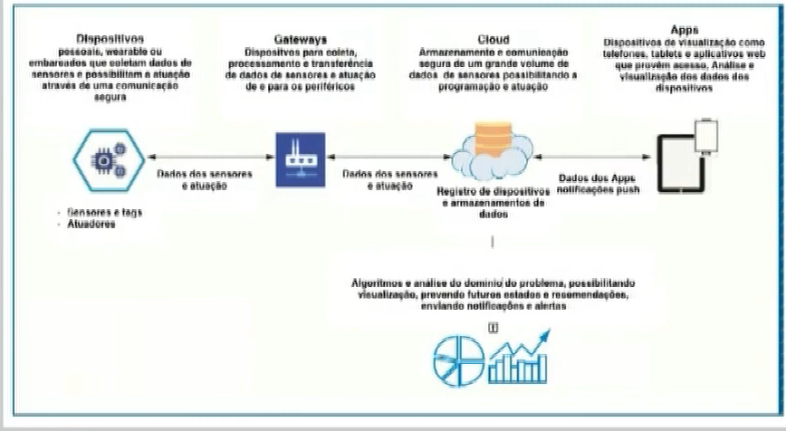

# SEMANA 6
Professora Alessandra Alaniz Macedo

**Internet das Coisas**

- Nas décadas de 70 e 80,a  internet era uma forma de conectar computadores.

- Os anos 90 e 2000, marcaram a internet como uma ferramenta de conexão entte as pessoas.

- Agora, a ênfase está mudando de forma e passou a conectar tudo (todas as coisas) à internet.

---

**IOT**

- Aquisição de dados.
- Análise dos dados em tempo real e offline.
- Aprendizado de máquina.
- Visualização de dados.
- Tópicos importantes para big data.

---

**Arquitetura**

---

A importância nas áreas de meio ambiente, cidades inteligentes, agricultura, saúde, alimentos, e mais.