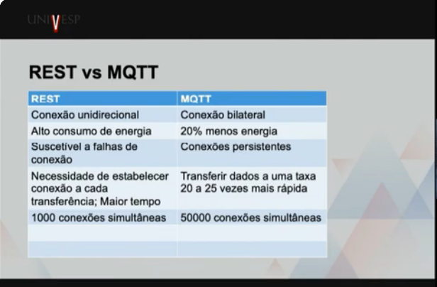

# SEMANA 6
Professora Alessandra Alaniz Macedo

**MQTT e REST**

---

- **MQTT** (Message Queue Telemetry Transport)
- **REST** (Representational State Transfer)

---

### 1. Aprofundando no MQTT (Modelo Publish/Subscribe)

O MQTT não é apenas envio direto; ele utiliza um intermediário chamado **Broker**.

* **Pub/Sub:** O dispositivo que gera o dado (Sensor) é o **Publisher**. Quem recebe é o **Subscriber**. Eles não se conhecem, apenas conhecem o Broker.
* **Tópicos:** A comunicação é organizada por caminhos, como `casa/quarto/temperatura`.
* **QoS (Quality of Service):** Define a confiabilidade da entrega:
    * **QoS 0:** Entrega no máximo uma vez (rápido, mas pode perder).
    * **QoS 1:** Entrega pelo menos uma vez (garante recepção, mas pode duplicar).
    * **QoS 2:** Entrega exatamente uma vez (mais lento, porém mais seguro).
* **Vantagem:** Extremamente leve, ideal para dispositivos com bateria limitada e redes instáveis (IoT).

### 2. Aprofundando no REST (Modelo Request/Response)

O REST é baseado no protocolo **HTTP** e é centrado em **Recursos** (identificados por URLs).

* **Stateless:** O servidor não armazena o estado da conexão. Cada requisição deve ser completa por si só.
* **Métodos (Verbos) HTTP:**
    * `GET`: Solicita um recurso (ex: ler dados do sensor).
    * `POST`: Cria um novo recurso.
    * `PUT`: Atualiza um recurso existente.
    * `DELETE`: Remove um recurso.
* **Formatos:** Geralmente utiliza **JSON** para o corpo das mensagens devido à facilidade de leitura por humanos e máquinas.

---

---

* **MQTT é como o WhatsApp:** Você entra em um grupo (tópico). Quando alguém envia uma mensagem, todos recebem instantaneamente sem precisar pedir.
* **REST é como um Restaurante:** Você faz o pedido (Request), o garçom traz o prato (Response). Se você quiser saber se a comida está pronta, tem que chamar o garçom de novo.