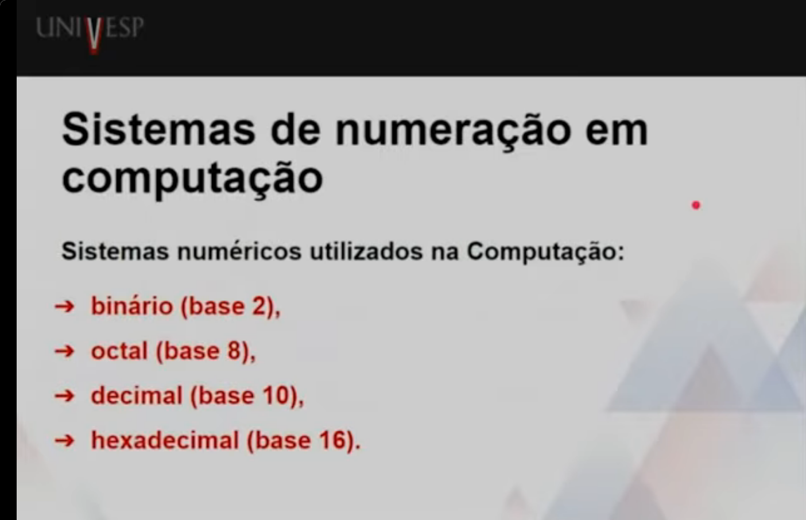

# Introdução a Conceitos de Computação
Professor Cláudio Fabiano Motta Toledo

## Semana 2

**Dados**

    - Elementos conhecidos de um problema
    - Desprovidos de significado, são considerados isoladamente.

**Informação**

    - Conjunto estruturado de dados.
    - Possuem utilidade e podem gerar ações.

**Informação**

    - Conjunto estruturado de dados.
    - Possuem utilidade e podem gerar ações.

**Codificação Binária:** Unidade básica de armazenamento em memória e disco usada pelos computadores e formatada por 8 bits.

**Sistemas de numeração e conversão de bases**

