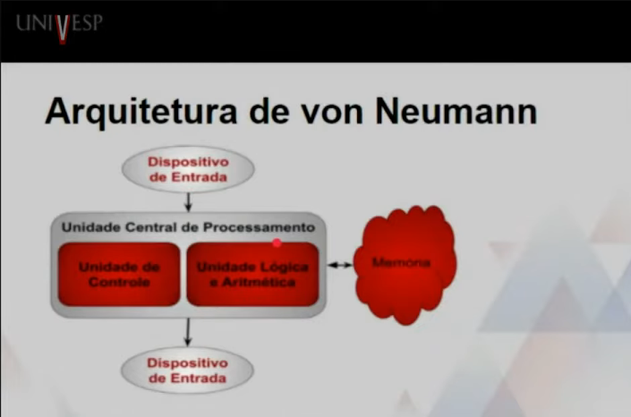
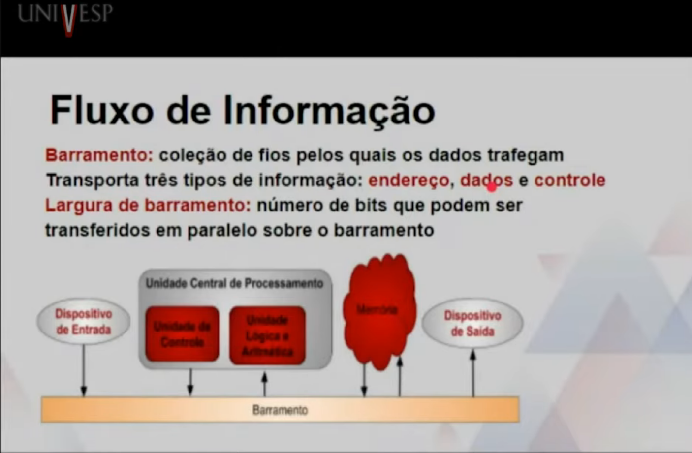
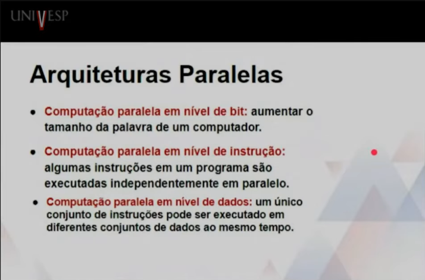

# Introdução a Conceitos de Computação
Professor Cláudio Fabiano Motta Toledo

## Semana 5

---

## Hardware

#### Arquitetura de Von Neumann

Von Neumann participou do projeto manhatan(bomba nuclear). Ele também cunhou o termo arquitetura de neumann.

#### Memória

Basicamente memória é uma coleção de células, cada uma com um único endereço físico.

- **RAM (Random Access Memory)**: célula pode ser acessada diretamente.
- **ROM (Read Only Memory)** memória apenas de leitura.

*OBS:* RAM é volátil e ROM não é.

**Endereçabilidade** número de bits armazenados em cada localização endereçável de memória.

 Leitura <-- (memória) --> Escrita

---

#### Unidade Lógica Aritmética

O acesso a memória é lento a nível de processamento.**Registrador**  que é uma pequena área de armazenamento na *CPU* usada para guardar valores intermediários ou dados especiais. E temos o **ALU** que realiza operações aritméticas e opearações lógicas.

**Unidade de Entrada**

Dispositovs que aceitam dados a serem armazenados em memórias. Enviando dados. Exemplos: Mouse, teclado, controle.

**Unidade de Saída**

Dispositivo que imprime dados armazenados em memória, ou faz uma cópia permanente de informação armazenada em memória ou em outro dispositivo. Exemplos: Monitor, projetor, impressora.

**Unidade de Controle**

Encarregada do ciclo de busca-execução. Executa operações de busca, decodificando e executando tarefas. Há o **Contador de programa** (CP) que é um registrador que contém o endereço da próxima instrução a ser executada. Pode ser considerado o cerébro do computador.

--- 

- **Memória Cache**: tipo de memória pequena e de alta velocidade destinada a guardar dados frequentemente usados.
- **Encadeamento**: técnica que desmembra uma instrução em passos menores que podem ser sobrepostos.
- **Placa-Mãe**: principal placa de circuito de um computador pessoal.

---

#### Ciclo Busca-Execução

Esse ciclo é o coração do funcionamento da CPU. Ele descreve como o processador executa instruções armazenadas na memória.

1. **Busca** (Fetch)

O contador de programa (CP) indica o endereço da próxima instrução.

A CPU acessa a memória nesse endereço e copia a instrução para um registrador especial chamado registrador de instrução.

2. **Decodificação** (Decode)

A unidade de controle interpreta a instrução buscada.

Ela identifica qual operação deve ser realizada (ex.: soma, comparação, salto) e quais dados ou registradores serão usados.

3. **Execução** (Execute)

A instrução é realizada pela ALU (se for cálculo ou lógica) ou pela unidade de controle (se for movimentação de dados).

O resultado pode ser armazenado em um registrador ou na memória.

4. **Atualização** (Update)

O contador de programa é incrementado para apontar para a próxima instrução.

*O ciclo recomeça.*

#### Sistemas Embarcados

- Computadores projetados para realizar uma faixa estreita de funções como uma parte de um sistema maior.

- O sistema embarcado fica usualmente em uma única pastilha de microporcessador com os programas armazenados em ROM.

#### Arquiteturas Paralelas

#### Arquitetura Interna de um PC resumidamente

**Memória RAM**
- Armazena dados e programas de forma temporária.
- É volátil (perde os dados quando o computador é desligado).
- Baseada em bits (0 ou 1), que são a unidade mínima de informação.

**Processador (CPU / Microprocessador)**
- É o “cérebro” do computador.
-Faz cálculos, decisões e executa instruções.
- Trabalha com dados binários e segue instruções armazenadas na memória.
- Incorpora funções da unidade central em um circuito integrado.

**Barramento**
- Conjunto de linhas de comunicação que interligam CPU, memória e periféricos.
- Mede-se pela largura (quantos bits transmite de uma vez: 8, 16, 32, 64...) e pela velocidade (bps, Kbps, Mbps, Gbps).
- É como a “rodovia” por onde os dados trafegam dentro do computador.

**Dispositivos de Entrada e Saída (E/S)**
- Entrada: convertem informações externas em dados digitais (ex.: teclado, mouse).
- Saída: transformam dados digitais em informação compreensível (ex.: monitor, impressora).
- Alguns são híbridos (entrada e saída), como modem, disquete e redes de computadores.

